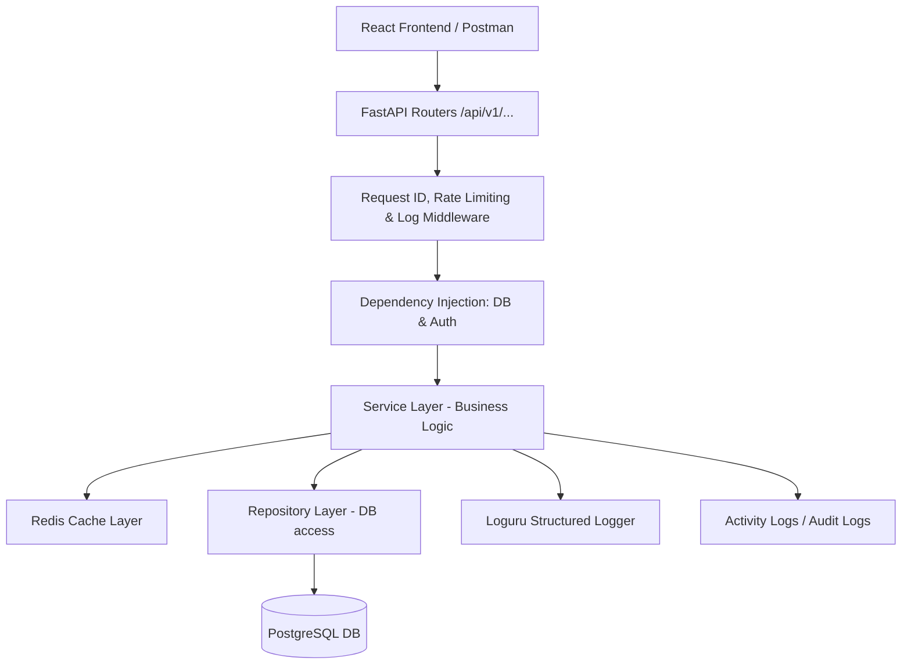
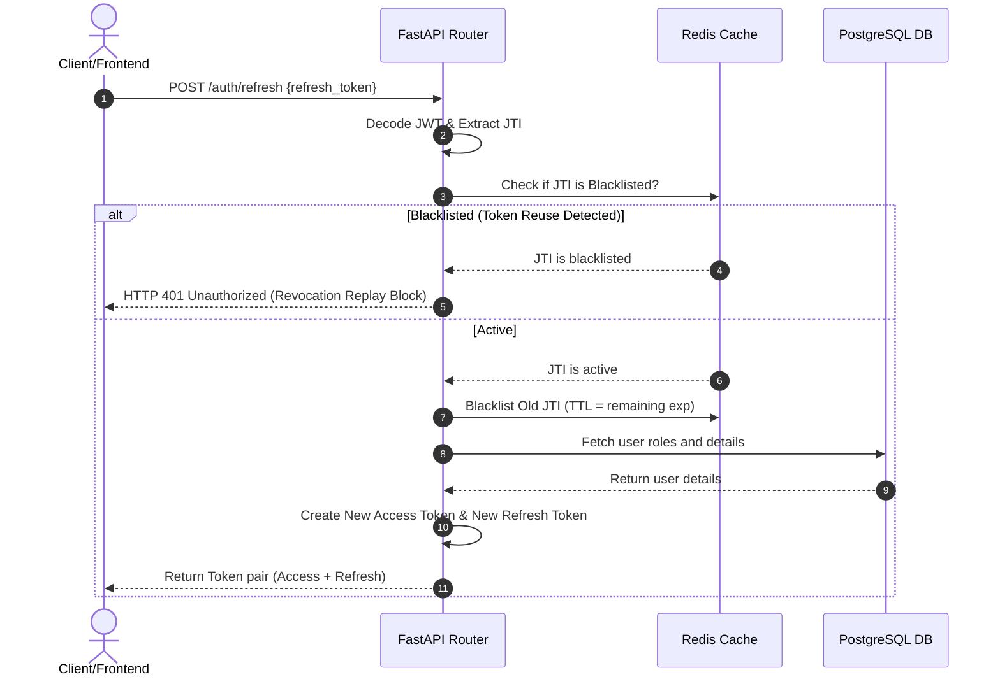
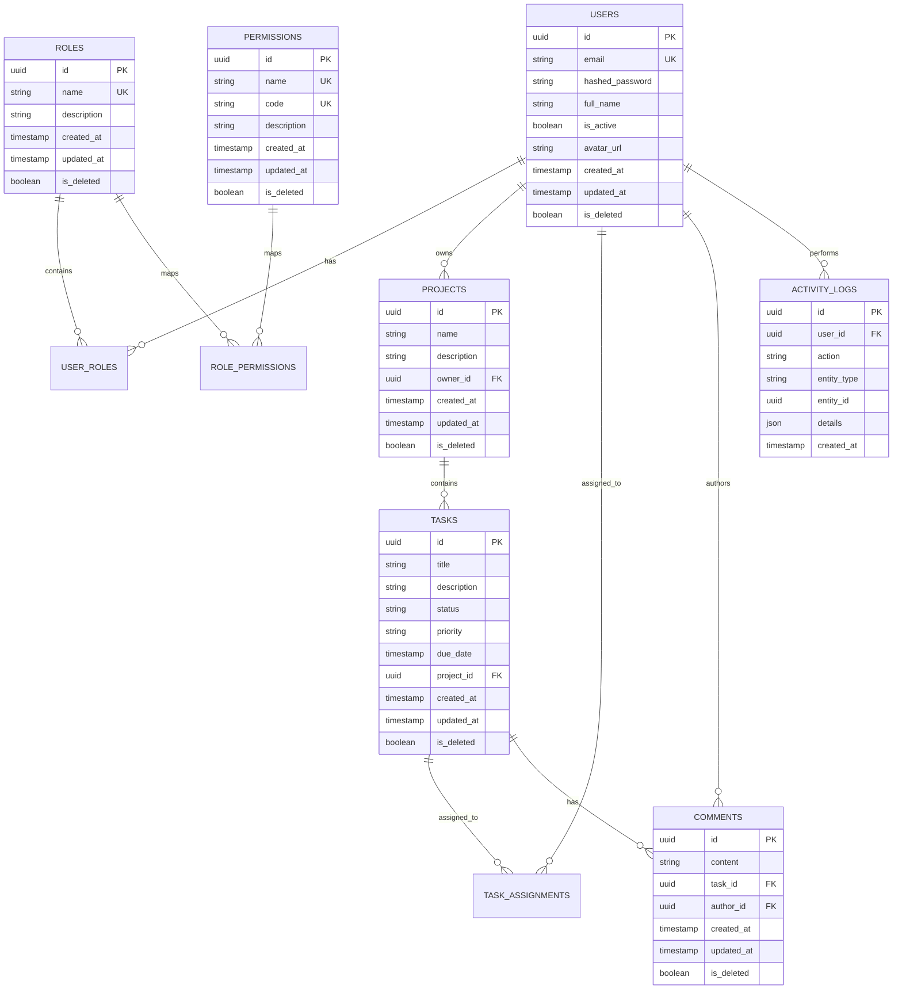

# PMS - Enterprise Project Management System

An enterprise-ready, high-performance, and secure **Project Management System (PMS)** built with **FastAPI (Python 3.12)**, **React**, **PostgreSQL**, and **Redis**. This workspace represents production-quality software architecture, strict Role-Based Access Control (RBAC), Redis-backed token-blacklisting, rate-limiting, and cache invalidation policies.

---

## 🏗️ System Architecture & Flow

### 1. High-Level Architecture Flow



### 2. Authentication Flow (Refresh Token Rotation with Replay Protection)



### 3. Entity-Relationship (ER) Diagram



---

## 🔒 Security & Compliance Matrix

- **Role-Based Access Control (RBAC)**: Fine-grained permissions (e.g., `project:create`, `task:delete`, `audit:read`) are mapped to roles (`Admin`, `Manager`, `Employee`).
- **Employee Update Constraints**: Enforces business logic so Employees can only modify the `status` column of tasks specifically assigned to them.
- **SQL Injection Prevention**: Built on SQLAlchemy 2.0 ORM using strictly typed parameters.
- **XSS Mitigation**: Cleanses user input text fields using custom regex validators to strip out HTML and Javascript scripts.
- **CORS & Secure Headers**: Restricts request origins using whitelist filters and logs Request/Correlation IDs for audit checks.

---

## 🚀 Setup & Execution Guide

### Option 1: Quick Start via Docker Compose

1. Clone or navigate to the repository directory.
2. Initialize environment parameters by copying the default template:
   ```bash
   cp .env.example .env
   ```
3. Boot up the environment:
   ```bash
   docker-compose up --build
   ```
4. Access endpoints:
   - **Frontend UI**: `http://localhost/`
   - **Backend API Docs (Swagger)**: `http://localhost:8000/docs`

### Option 2: Local Manual Setup

#### 1. Requirements
Ensure you have active PostgreSQL and Redis servers running locally. Update credentials inside `.env`.

#### 2. Backend Setup
Make sure you have `make` installed, or execute commands directly from the [Makefile](file:///c:/Users/Honey/OneDrive/Desktop/prime/Makefile):
```bash
# Install dependencies
make install

# Run database migrations and seed default parameters
make migrate
make seed

# Start server
make run
```

#### 3. Run Pytest Suite
```bash
make test
```

---

## 📈 Performance & Scaling Strategy

### 1. Database Optimizations
- **Indexing**: Database columns heavily queried for filter sorting (`is_deleted`, `email`, `project_id`, `status`, `priority`) are indexed to maintain search complexity under logarithmic bounds.
- **Connection Pooling**: Configured SQLAlchemy with `pool_size=20` and `max_overflow=10` to optimize concurrent request handshakes.
- **N+1 Mitigation**: Implemented eager loading relationships (`selectinload`) to avoid nested database queries.

### 2. Caching Strategy (Redis)
- **Dashboard Stats**: Pre-calculates and caches numerical dashboard analytics under a `dashboard:stats` key with a 5-minute TTL.
- **Project Lists**: Caches projects lists under `projects:list:skip={skip}:limit={limit}:search={search}`.
- **Cache Invalidation**: Whenever a write mutation (create, edit, delete) targets projects or tasks, related cache keys are deleted.

### 3. Scaling out: Microservice Migration Roadmap
If this system experiences high volumes, we can split it into three microservices:
1. **Auth & Directory Service**: Manages accounts, JWT signatures, and RBAC rules.
2. **Projects & Task Planner Service**: Handles project Kanban structures and assignments.
3. **Audit Logger Service**: Listens to system activity events published on a message broker (e.g. Apache Kafka or RabbitMQ) and writes them to a separate search-optimized database (e.g., Elasticsearch).

---

## 🧑‍💻 Credentials for Initial Login

- **Username / Email**: `admin@example.com`
- **Password**: `Admin@1234!`
- **Release Version**: `v1.0.0`
- **License**: MIT
